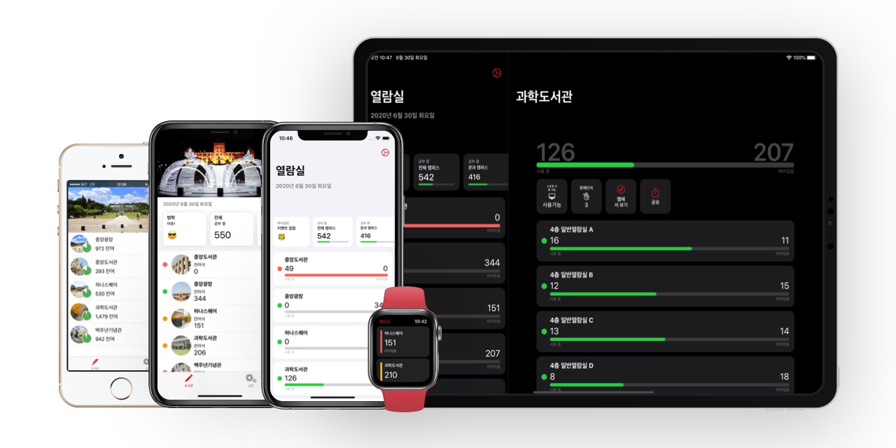

# kuStudy - Korea University Study Area App

__Download on App Store__

https://apps.apple.com/app/id925255895

__Specification__

Built with Xcode 11, Swift 5, dependency managed by Swift Package Manager.

__Notice__

Alternative icons are manager using `embed-alternate-icons` buidl phase. See https://github.com/alexaubry/alternate-icons for details.

__Credit__

Developed & Designed by __BumMo Koo__

__Contribution__

If you are interested in contributing to this app, contact me at ksquareatm@gmail.com.

## LICENSE

__Apache License__

See LICENSE file.

_Name and symbol of Korea University are trademarks of Korea University. Refer to [Korea University website](http://www.korea.ac.kr/mbshome/mbs/university/subview.do?id=university_010410010000)_.

