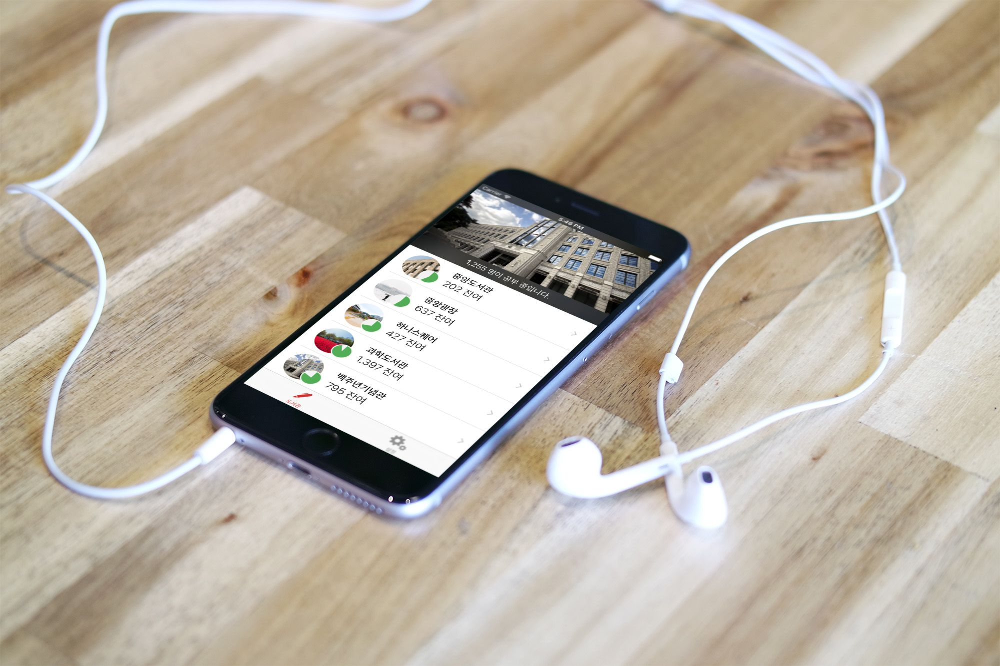

# kuStudy - Korea University Reading Room App

-----

## Installation

* Xcode 9 and above
* Swift 4
* CocoaPods

## Architecture

* kuStudy (Universal iOS 11)
* kuStudyKit (Dynamic Framework)
* kuStudyWatchKit (Dynamic Framework)
* kuStudy Today Extension
* kuStudy WatchKit Extension
* kuStudy WatchKit App

## Troubleshoot

Q. Error "Today extension contains disallowed file 'Frameworks'." when uploading to iTunes Connect.

A. Remove [CP]Embed Pods Frameworks build phase from Today Extension target.

## Credit

__BumMo Koo__: Develop / Design / Internaionalization

Photography credits are in app settings.
